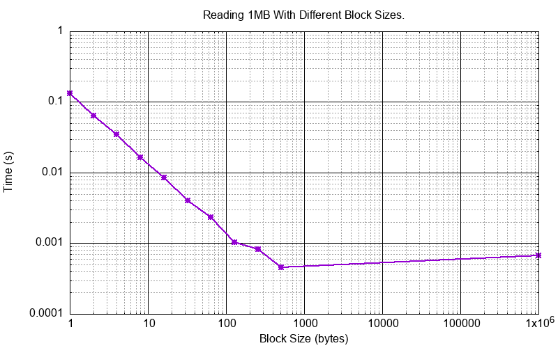
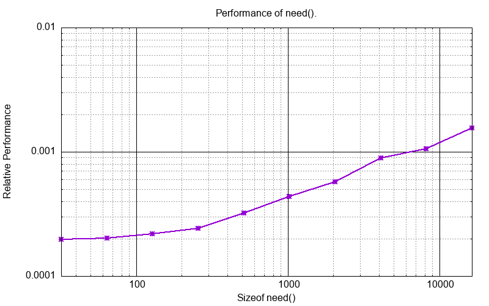
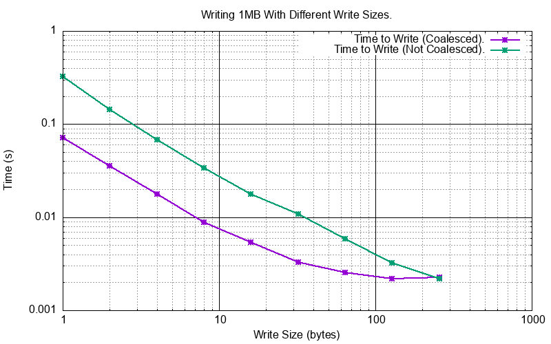
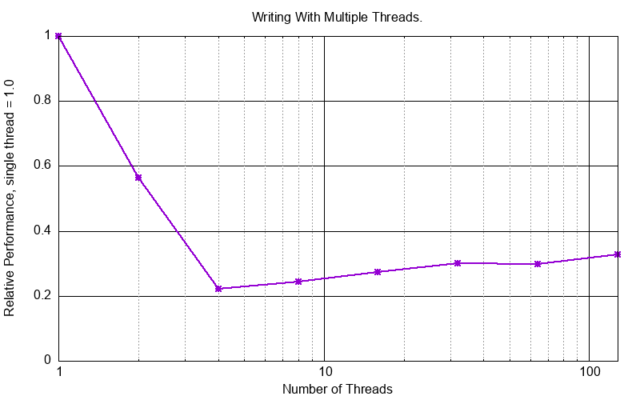
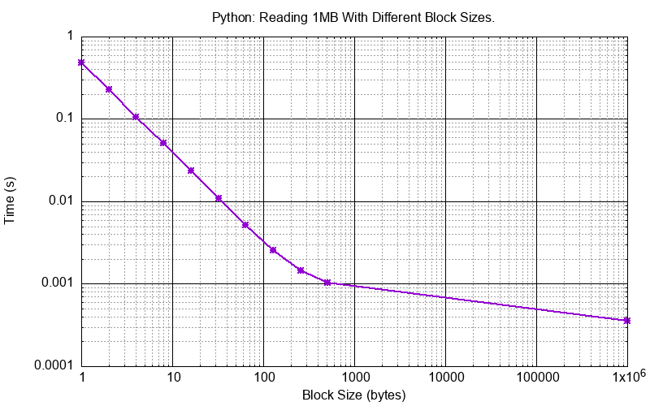
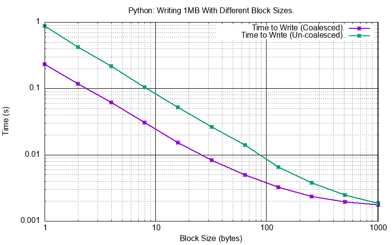
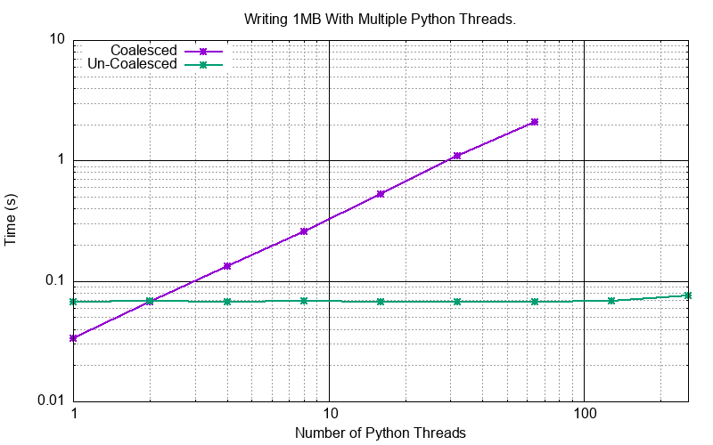

Performance
###########

This describes some of the measured performance of ``SVFS``.

C++ Performance
===============

Read
----

This test simulates reading from a one Megabyte of data arranged in a sparse form with different block sizes from 1 byte to 512 bytes.
For the one byte case there are 1,000,000 blocks each of 1 byte, for the 512 byte case there are 2,048 blocks each of 512 bytes.
In the extreme right the data is coalesced into a single one Megabyte block.

The y axis shows the time to read all blocks.

The one byte case corresponds to 7.6 MB/s, the 512 bytes case corresponds to 2,174 MB/s, the single 1MB block case
corresponds to 1,480 MB/s.

Need
----

This test simulates writing a low level RP66V1 index and then running need on it.
Total bytes written around 1Mb.
Blocks are 800 bytes apart.
There are 238,310 blocks.

This shows good linear performance.

Write
-----

This show the performance of writing 1MB of data to a ``SVF`` in two ways:

- Each write is contiguous with a previous one so the blocks are always coalesced. The ``SVF`` always contains only one block.
- Each write is *not* contiguous with a previous one so the blocks are *never* coalesced. The ``SVF`` eventually contains as many blocks as writes.

In the case of storing 1M one byte blocks the ``SVF`` consumes 34,603,192 bytes of memory, so x33.
In the case of a 256 byte block size the ``SVF`` consumes 1,179,832 bytes of memory, just a 12.5% premium.

Multi-threaded Writes
---------------------

This looks at the performance where many threads might be writing independently to a single ``SVF``.
This requires the code be compiled with ``SVF_THREAD_SAFE``.

This test is done with the test function ``test_write_multithreaded_coalesced()`` and
``test_write_multithreaded_un_coalesced()`` with a varying number of threads.

This test writes/overwrites a 1MB file with 8 bytes writes.
In the coalesced case these writes are all to one block.
In the un-coalesced case these writes are all to multiple (1024 * 1024 / 8) blocks.

Python Performance
==================

Read
--------------------

This test simulates reading from a one Megabyte of data arranged in a sparse form with different block sizes from 1 byte to 512 bytes.
For the one byte case there are 1,000,000 blocks each of 1 byte, for the 512 byte case there are 2,048 blocks each of 512 bytes.
In the extreme right the data is coalesced into a single one Megabyte block.

The y axis shows the time to read all blocks.

The Python performance is about x5 compared to C++ for the one byte case and nearly equal to C++ for the large block cases.

Write
--------------------

This show the performance of writing 1MB of data to a ``SVF`` in two ways:

- Each write is contiguous with a previous one so the blocks are always coalesced. The ``SVF`` always contains only one block.
- Each write is *not* contiguous with a previous one so the blocks are *never* coalesced. The ``SVF`` eventually contains as many blocks as writes.

The Python performance is about x3 compared to C++ for the one byte case and nearly equal to C++ for the large block cases.

Multi Threaded Write
--------------------

The Python module is compiled *without* ``SVF_THREAD_SAFE`` and ``SVFS_THREAD_SAFE`` so that the C++ mutexes are not used.
Instead Python thread locks are used with ``AcquireLockSVF`` and ``AcquireLockSVFS`` that are wrappers around ``PyThread_acquire_lock()`` and ``PyThread_release_lock()``.

This test writes/overwrites a 1MB file with 8 bytes writes.
In the coalesced case these writes are all to one block.
In the un-coalesced case these writes are all to multiple (1024 * 1024 / 8) blocks.

The result is quite different from the C++ result given above.
