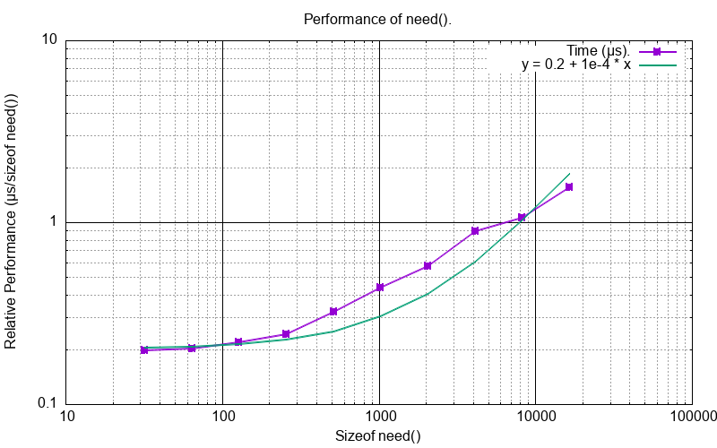
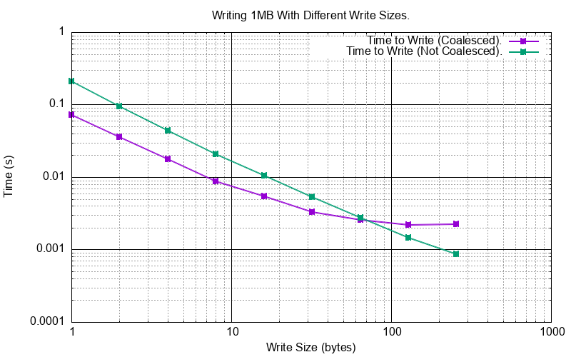
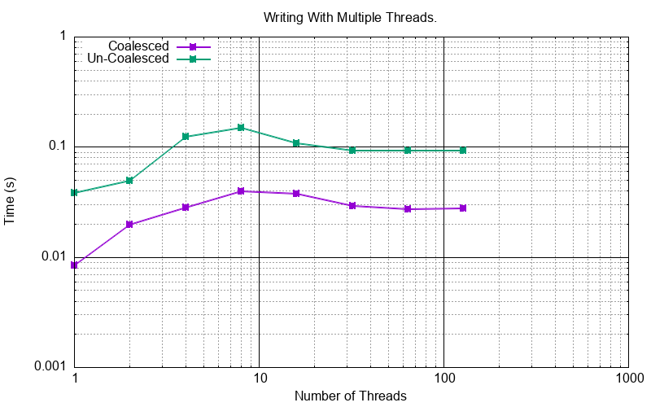
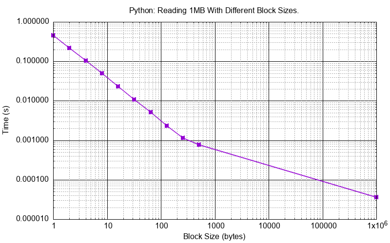
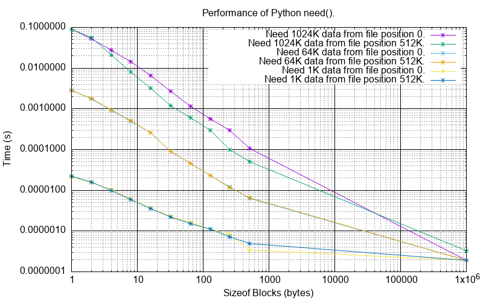

Performance
###########

This describes some of the measured performance of ``SVFS``.
Platform is a 2018 Mac Book Pro, 2.7 GHz Intel Core i7, 16 GB RAM.

C++ Performance
===============

Read
----

This test simulates reading from a one Megabyte of data arranged in a sparse form with different block sizes from 1 byte to 512 bytes.
For the one byte case there are 1,000,000 blocks each of 1 byte, for the 512 byte case there are 2,048 blocks each of 512 bytes.
In the extreme right the data is coalesced into a single one Megabyte block.

The y axis shows the time to read all blocks.

The one byte case corresponds to 6.3 MB/s, the 512 bytes case corresponds to 4,540 MB/s, the single 1MB block case
corresponds to 2,300 MB/s.

Need
----

This test simulates writing a low level RP66V1 index and then running need on it.
Total bytes written around 1Mb.
Blocks are about 800 bytes apart.
There are 238,310 blocks.

This shows good linear performance.

Write
-----

This show the performance of writing 1MB of data to a ``SVF`` in two ways:

- Each write is contiguous with a previous one so the blocks are always coalesced. The ``SVF`` always contains only one block.
- Each write is *not* contiguous with a previous one so the blocks are *never* coalesced. The ``SVF`` eventually contains as many blocks as writes.

In the case of storing 1M one byte blocks the ``SVF`` consumes 34,603,192 bytes of memory, so x33.
In the case of a 256 byte block size the ``SVF`` consumes 1,179,832 bytes of memory, just a 12.5% premium.

The one byte block size performance corresponds to 14 MB/s (coalesced) and 3.1 MB/s (un-coalesced).
The 256 byte block size performance corresponds to 445 MB/s (coalesced) and 456 MB/s (un-coalesced).

Multi-threaded Writes
---------------------

This looks at the performance where many threads might be writing independently to a single ``SVF``.
This requires the code be compiled with ``SVF_THREAD_SAFE`` and ``SVFS_THREAD_SAFE``.

This test is done with the test function ``test_write_multithreaded_coalesced()`` and
``test_write_multithreaded_un_coalesced()`` with a varying number of threads.

This test writes/overwrites a 1MB file with 8 bytes writes.
In the coalesced case these writes are all to one block.
In the un-coalesced case these writes are all to multiple (1024 * 1024 / 8) blocks.

Python Performance
==================

Read
--------------------

This test simulates reading from a one Megabyte of data arranged in a sparse form with different block sizes from 1 byte to 512 bytes.
For the one byte case there are 1,000,000 blocks each of 1 byte, for the 512 byte case there are 2,048 blocks each of 512 bytes.
In the extreme right the data is coalesced into a single one Megabyte block.

The y axis shows the time to read all blocks.

The Python performance is about 5x compared to C++ for the one byte case and nearly equal to C++ for the large block cases.

Need
-------------

This measures the performance of ``need()`` for a 1MB SVF under various conditions:

One Megabyte of data is loaded into an SVF un-coalesced equal sized blocks, the block sizes range from 1 byte to 512 bytes.
For the one byte case there are 1,000,000 blocks each of 1 byte, for the 512 byte case there are 2,048 blocks each of 512 bytes and so on.
In the extreme right the data is coalesced into a single one Megabyte block.

A ``need()`` request is made for various 'need' sizes (1KB, 64KB, 1025KB) and file positions (0, 512KB).
For example a ``need()`` request of 64KB  on the un-coalesced SVF of 1 byte blocks will generate a need list 64K long.
The same request on the un-coalesced SVF of 128 byte blocks will generate a need list of length 64K / 128 = 512.

Observations:

- The ``need()`` time is pretty much independent of file position.
- The ``need()`` time for a particular size is proportional to the fragmentation of the SVF (inversely proportional to the block size).
- The ``need()`` time is roughly proportional to the size of the need request regardless of the fragmentation of the SVF.
- All the configurations converge on the extreme right as it is a coalesced 1MB SVF so the need list is empty.  This represents the lower bound for ``need()``, typically 0.2 µs.

Write
--------------------

This show the performance of writing 1MB of data to a ``SVF`` in two ways:

- Each write is contiguous with a previous one so the blocks are always coalesced. The ``SVF`` always contains only one block.
- Each write is *not* contiguous with a previous one so the blocks are *never* coalesced. The ``SVF`` eventually contains as many blocks as writes.

The Python performance is about 3x compared to C++ for the one byte case and nearly equal to C++ for the large block cases.

Multi Threaded Writes
---------------------

The Python module is compiled *without* ``SVF_THREAD_SAFE`` and ``SVFS_THREAD_SAFE`` so that the C++ mutexes are not used.
Instead Python thread locks are used with ``AcquireLockSVF`` and ``AcquireLockSVFS`` that are wrappers around ``PyThread_acquire_lock()`` and ``PyThread_release_lock()``.

This test writes/overwrites a 1MB file with 8 bytes writes.
In the coalesced case these writes are all to one block.
In the un-coalesced case these writes are all to multiple (1024 * 1024 / 8) blocks.

The result is quite different from the C++ result given above.
