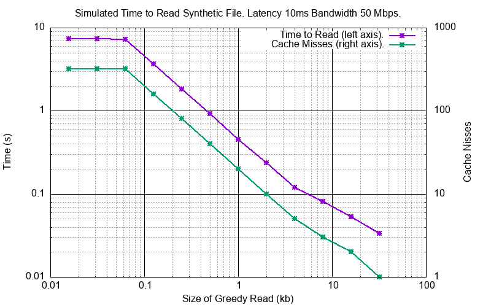
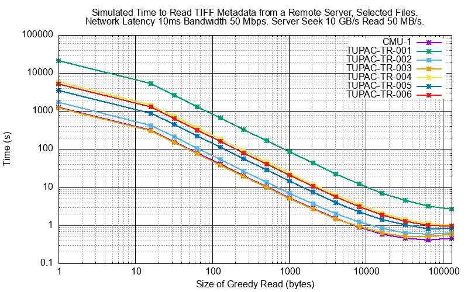
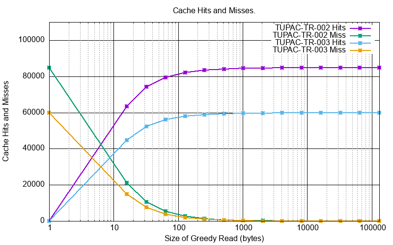
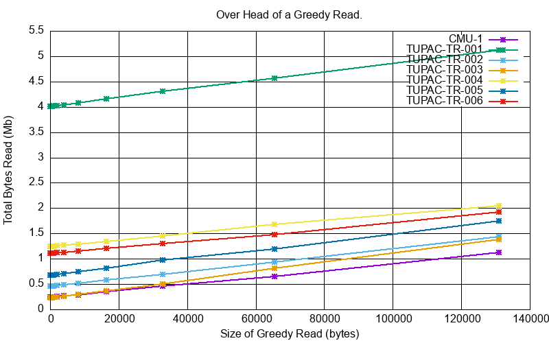

Technical Notes
################

Pickling
========

Pickling
--------

A Sparse Virtual File (``svfs.cSVF``) can be pickled:

.. code-block:: python

    import pickle
    import svfs

    svf = svfs.cSVF('id')
    svf.write(21, b'ABCDEF')
    pickle_result = pickle.dumps(svf)
    # Save pickle_result somewhere

Un-Pickling
-----------

And to un-pickle:

.. code-block:: python

    import pickle
    import svfs

    svf = svfs.cSVF('id')
    svf.write(21, b'ABCDEF')
    pickle_result = pickle.dumps(s)
    new_svf = pickle.loads(pickle_result)
    assert id(new_svf) != id(svf)
    assert new_svf.id() == svf.id()
    assert new_svf.file_mod_date() == svf.file_mod_date()
    assert new_svf.blocks() == svf.blocks()

Pickling is *versioned* by an integer number.
As `svfs` progresses this ensures that pickles from previous ``svfs`` versions can be detected and either rejected or
read as modified.

Using `pickletools`
-------------------

.. code-block:: python

    import pickle
    import pickletools
    import svfs

    svf = svfs.cSVF('id')
    svf.write(1, b' ')
    svf.write(12, b' ')
    pickle_result = pickle.dumps(s)
    pickletools.dis(pickle_result)

The result will be something like:

.. code-block:: text

        0: \x80 PROTO      4
        2: \x95 FRAME      106
       11: \x8c SHORT_BINUNICODE 'svfs'
       17: \x94 MEMOIZE    (as 0)
       18: \x8c SHORT_BINUNICODE 'cSVF'
       24: \x94 MEMOIZE    (as 1)
       25: \x93 STACK_GLOBAL
       26: \x94 MEMOIZE    (as 2)
       27: )    EMPTY_TUPLE
       28: \x81 NEWOBJ
       29: \x94 MEMOIZE    (as 3)
       30: }    EMPTY_DICT
       31: \x94 MEMOIZE    (as 4)
       32: (    MARK
       33: \x8c     SHORT_BINUNICODE 'id'
       37: \x94     MEMOIZE    (as 5)
       38: \x8c     SHORT_BINUNICODE 'id'
       42: \x94     MEMOIZE    (as 6)
       43: \x8c     SHORT_BINUNICODE 'file_mod_time'
       58: \x94     MEMOIZE    (as 7)
       59: G        BINFLOAT   1.0
       68: \x8c     SHORT_BINUNICODE 'blocks'
       76: \x94     MEMOIZE    (as 8)
       77: K        BININT1    1
       79: C        SHORT_BINBYTES b' '
       82: \x94     MEMOIZE    (as 9)
       83: \x86     TUPLE2
       84: \x94     MEMOIZE    (as 10)
       85: K        BININT1    12
       87: C        SHORT_BINBYTES b' '
       90: \x94     MEMOIZE    (as 11)
       91: \x86     TUPLE2
       92: \x94     MEMOIZE    (as 12)
       93: \x86     TUPLE2
       94: \x94     MEMOIZE    (as 13)
       95: \x8c     SHORT_BINUNICODE 'pickle_version'
      111: \x94     MEMOIZE    (as 14)
      112: K        BININT1    1
      114: u        SETITEMS   (MARK at 32)
      115: b    BUILD
      116: .    STOP
    highest protocol among opcodes = 4

Detecting File Changes
========================

This is tricky. If the remote file changes there is no real way that the ``SVF`` can know of this.
There are a couple of ways that the user of an ``SVF`` can detect this however.

File Modification Time
----------------------

On construction the ``SVF`` can take an optional file modification time as a float.
The user can query this with ``file_mod_time()`` and compare it with the latest file modification time and act
accordingly (like using ``.clear()`` and reload as necessary).

Cautious Overwrite
------------------

On construction the ``SVF`` can take an optional flag ``compare_for_diff``.
If True, then when making a ``write()`` if a data difference is detected on an overwrite an ``IOError`` will be raised.
This is a weak detection technique and adds about 25% to the cost of an overlapping write.

Greedy Gets
==================

With a high latency connection it will be expensive to make a lot of small requests so it makes sense to make a smaller
number of larger GETs.
This is done by passing a ``greedy_length`` value to ``need()`` and that will coalesce the result of ``need()`` where possible.

For example an ``SVF`` with these ``{file_position, length}`` blocks:

.. code-block:: text

    ((8,  4), (16, 4), (32, 4))

Requesting 40 bytes from file position 8 gives this minimal block set by ``need(8, 40)``:

.. code-block:: text

    ((12, 4), (20, 12), (36, 12),)

The same request with ``need(8, 40, greedy_length=64)`` gives this block set:

.. code-block:: text

    ((12, 64),)

Network Simulator
=====================================

In ``cpy/simulator.py`` there is a simulator that can reproduce the effect of network latency, network bandwidth, server
seek/read times and writing data to a ``SVF``. The default configuration is:

- Network latency (each way): 10 milliseconds.
- Network bandwidth: 50 million bits per second.
- Server seek speed: 1000 million bytes per second.
- Server read speed: 50 million bytes per second.

The simulator can also take a ``greedy-length`` argument which allows you to tune your GET requests.

Some pre-built simulation requests are in ``cpy/sim_example.py``:

- A simple read of 32 bytes of data every  64 bytes up to a size of 20480.
- Actual seek/read operations for reading TIFF metadata on a 200 MB compressed TIFF file.

Here is the read time using different ``greedy_length`` values:

The second example is all the seek read operations to get all the TIFF metadata from selected TIFF files:

.. list-table:: Selected TIFF Files
    :align: center
    :widths: 50 25 25
    :header-rows: 1

    * - File
      - File Size (Mb)
      - File Events
    * - CMU-1.tiff
      - 194.7
      - 62,615
    * - TUPAC-TR-001.svs
      - 2,145.6
      - 1,051,242
    * - TUPAC-TR-002.svs
      - 657.2
      - 84,845
    * - TUPAC-TR-003.svs
      - 563.3
      - 59,936
    * - TUPAC-TR-004.svs
      - 744.2
      - 291,302
    * - TUPAC-TR-005.svs
      - 954.5
      - 176,754
    * - TUPAC-TR-006.svs
      - 945.3
      - 254,948

The performance improvement is because ``SVF.has()`` is far more likely to succeed at larger ``greedy_length`` values.
Here are some file examples with the count of cache hits (``SVF.has()`` succeeds) and cache misses (``SVF.has()`` fails).

The minor drawback is that more bytes are read than strictly necessary.
For example with CMU-1.tiff and ``greedy_length=0`` the minimal byte set is
256,566 bytes total. With a ``greedy_length=131,072`` the total number of bytes read is 1,179,648.
This is about 4x the minimal read but still about 1/200 of the original file.

Here are examples off the total amount of data read for different ``greedy_length`` values (NOTE: linear scale):

Running the Simulator
---------------------

The simulator uses data in ``src/cpy/sim_examples.py``, in there are a couple of examples.
These examples are just a tuple of ``(file_position, length)`` values (in any order).

.. code-block:: console

    $ python src/cpy/simulator.py -h
    usage: src/cpy/simulator.py [-h] [-l LOG_LEVEL]
                                     [--latency LATENCY]
                                     [--bandwidth BANDWIDTH]
                                     [--seek-rate SEEK_RATE]
                                     [--read-rate READ_RATE]
                                     [--greedy-length GREEDY_LENGTH]

    Simulate reading into a SVF.

    options:
      -h, --help            show this help message and exit
      -l LOG_LEVEL, --log-level LOG_LEVEL
                            Log level.
      --latency LATENCY     Communications channel latency (one way) in ms. [default: 10]
      --bandwidth BANDWIDTH
                            Communications channel bandwidth in million bits per second.
                            [default: 50]
      --seek-rate SEEK_RATE
                            Server seek rate in million bytes per second. [default: 1000]
      --read-rate READ_RATE
                            Server read rate in million bytes per second. [default: 50]
      --greedy-length GREEDY_LENGTH
                            The greedy length to read fragments from the server. Zero means read
                            every fragment. Default is to run through a range of greedy lengths
                            and report the performance. [default: -1]

With no arguments the simulator runs through a pre-prepared set of values.
If ``greedy-lenght`` is give then the simulator just runs on that value.
For example, exploring the simulator with a ``greedy_length`` of 1024:

.. code-block:: console

    $ python src/cpy/simulator.py --greedy-length=1024
    Simulator setup:
    Network latency 10.000 (ms) bandwidth 50.000 (M bits/s)
    Server seek rate 1000.000 (M bytes/s) read rate 50.000 (M bytes/s)
    2023-04-28 12:11:27,817 -             simulator.py#201  - INFO     - Running EXAMPLE_FILE_POSITIONS_LENGTHS_SYNTHETIC with greedy_length 1024
    2023-04-28 12:11:28,284 -             simulator.py#114  - INFO     - has(): hits 300 misses 20
    2023-04-28 12:11:28,284 -             simulator.py#115  - INFO     - Blocks 1 bytes 20480 sizeof 20634
    2023-04-28 12:11:28,284 -             simulator.py#117  - INFO     - Comms time :    403.387 (ms) ( 86.4%) +++++++++++++++++++++++++++++++++++++++++++
    2023-04-28 12:11:28,284 -             simulator.py#122  - INFO     - Server time:      0.429 (ms) (  0.1%)
    2023-04-28 12:11:28,284 -             simulator.py#127  - INFO     - SVF time   :      1.286 (ms) (  0.3%)
    2023-04-28 12:11:28,285 -             simulator.py#132  - INFO     - Residual   :     61.819 (ms) ( 13.2%) +++++++
    2023-04-28 12:11:28,285 -             simulator.py#136  - INFO     - Total      :    466.921 (ms) (100.0%)
    2023-04-28 12:11:28,285 -             simulator.py#137  - INFO     - SVF contents: 20480 Execution time: 0.467 (s) 0.042 (Mb/s)
    2023-04-28 12:11:28,285 -             simulator.py#201  - INFO     - Running EXAMPLE_FILE_POSITIONS_LENGTHS_TIFF_CMU_1 with greedy_length 1024
    2023-04-28 12:11:31,839 -             simulator.py#114  - INFO     - has(): hits 11866 misses 102
    2023-04-28 12:11:31,839 -             simulator.py#115  - INFO     - Blocks 10 bytes 104881 sizeof 105323
    2023-04-28 12:11:31,840 -             simulator.py#117  - INFO     - Comms time :   2057.567 (ms) ( 57.9%) +++++++++++++++++++++++++++++
    2023-04-28 12:11:31,840 -             simulator.py#122  - INFO     - Server time:    874.965 (ms) ( 24.6%) ++++++++++++
    2023-04-28 12:11:31,840 -             simulator.py#127  - INFO     - SVF time   :     23.065 (ms) (  0.6%)
    2023-04-28 12:11:31,840 -             simulator.py#132  - INFO     - Residual   :    598.706 (ms) ( 16.8%) ++++++++
    2023-04-28 12:11:31,840 -             simulator.py#136  - INFO     - Total      :   3554.303 (ms) (100.0%)
    2023-04-28 12:11:31,840 -             simulator.py#137  - INFO     - SVF contents: 104881 Execution time: 3.554 (s) 0.028 (Mb/s)
    EXAMPLE_FILE_POSITIONS_LENGTHS_SYNTHETIC:
     greedy_length   Time(ms)     Hits     Miss    Hits%      Bytes
              1024      468.1      300       20  93.750%      20480
    EXAMPLE_FILE_POSITIONS_LENGTHS_TIFF_CMU_1:
     greedy_length   Time(ms)     Hits     Miss    Hits%      Bytes
              1024     3555.4    11866      102  99.148%     104881
    Execution time:      4.027 (s)

Thread Safety
=============

If compiled with ``SVF_THREAD_SAFE`` and ``SVFS_THREAD_SAFE`` defined a C++ mutex is introduced to preserve thread safety.

The Python implementation does *not* set ``SVF_THREAD_SAFE`` and ``SVFS_THREAD_SAFE``, instead it uses Python mutexes
using the technique `described here <https://pythonextensionpatterns.readthedocs.io/en/latest/thread_safety.html>`_.

