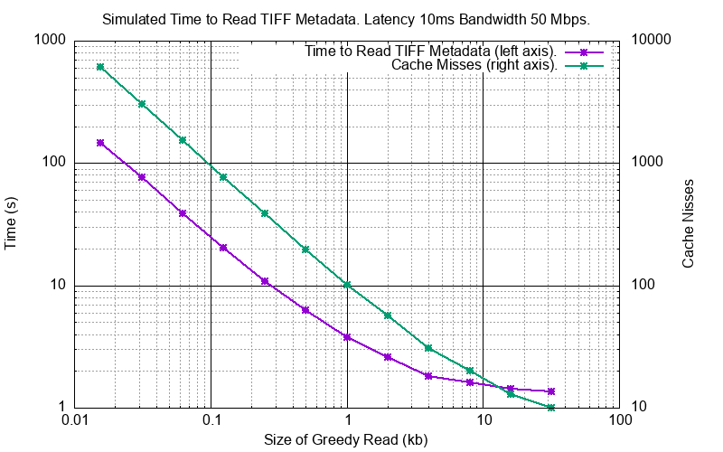

Technical Notes
################

Pickling
========

Pickling
--------

A Sparse Virtual File (``svfs.cSVF``) can be pickled:

.. code-block:: python

    import pickle
    import svfs

    svf = svfs.cSVF('id')
    svf.write(21, b'ABCDEF')
    pickle_result = pickle.dumps(svf)
    # Save pickle_result somewhere

Un-Pickling
-----------

And to un-pickle:

.. code-block:: python

    import pickle
    import svfs

    svf = svfs.cSVF('id')
    svf.write(21, b'ABCDEF')
    pickle_result = pickle.dumps(s)
    new_svf = pickle.loads(pickle_result)
    assert id(new_svf) != id(svf)
    assert new_svf.id() == svf.id()
    assert new_svf.file_mod_date() == svf.file_mod_date()
    assert new_svf.blocks() == svf.blocks()

Pickling is *versioned* by an integer number.
As `svfs` progresses this ensures that pickles from previous ``svfs`` versions can be detected and either rejected or
read as modified.

Using `pickletools`
-------------------

.. code-block:: python

    import pickle
    import pickletools
    import svfs

    svf = svfs.cSVF('id')
    svf.write(1, b' ')
    svf.write(12, b' ')
    pickle_result = pickle.dumps(s)
    pickletools.dis(pickle_result)

The result will be something like:

.. code-block:: text

        0: \x80 PROTO      4
        2: \x95 FRAME      106
       11: \x8c SHORT_BINUNICODE 'svfs'
       17: \x94 MEMOIZE    (as 0)
       18: \x8c SHORT_BINUNICODE 'cSVF'
       24: \x94 MEMOIZE    (as 1)
       25: \x93 STACK_GLOBAL
       26: \x94 MEMOIZE    (as 2)
       27: )    EMPTY_TUPLE
       28: \x81 NEWOBJ
       29: \x94 MEMOIZE    (as 3)
       30: }    EMPTY_DICT
       31: \x94 MEMOIZE    (as 4)
       32: (    MARK
       33: \x8c     SHORT_BINUNICODE 'id'
       37: \x94     MEMOIZE    (as 5)
       38: \x8c     SHORT_BINUNICODE 'id'
       42: \x94     MEMOIZE    (as 6)
       43: \x8c     SHORT_BINUNICODE 'file_mod_time'
       58: \x94     MEMOIZE    (as 7)
       59: G        BINFLOAT   1.0
       68: \x8c     SHORT_BINUNICODE 'blocks'
       76: \x94     MEMOIZE    (as 8)
       77: K        BININT1    1
       79: C        SHORT_BINBYTES b' '
       82: \x94     MEMOIZE    (as 9)
       83: \x86     TUPLE2
       84: \x94     MEMOIZE    (as 10)
       85: K        BININT1    12
       87: C        SHORT_BINBYTES b' '
       90: \x94     MEMOIZE    (as 11)
       91: \x86     TUPLE2
       92: \x94     MEMOIZE    (as 12)
       93: \x86     TUPLE2
       94: \x94     MEMOIZE    (as 13)
       95: \x8c     SHORT_BINUNICODE 'pickle_version'
      111: \x94     MEMOIZE    (as 14)
      112: K        BININT1    1
      114: u        SETITEMS   (MARK at 32)
      115: b    BUILD
      116: .    STOP
    highest protocol among opcodes = 4

Detecting File Changes
========================

This is tricky. If the remote file changes there is no real way that the ``SVF`` can know of this.
There are a couple of ways that the user of an ``SVF`` can detect this however.

File Modification Time
----------------------

On construction the ``SVF`` can take an optional file modification time as a float.
The user can query this with ``file_mod_time()`` and compare it with the latest file modification time and act
accordingly (like using ``.clear()`` and reload as necessary).

Cautious Overwrite
------------------

On construction the ``SVF`` can take an optional flag ``compare_for_diff``.
If True, then when making a ``write()`` if a data difference is detected on an overwrite an ``IOError`` will be raised.
This is a weak detection technique and adds about 25% to the cost of an overlapping write.

Greedy Gets
==================

With a high latency connection it will be expensive to make a lot of small requests so it makes sense to make a smaller
number of larger GETs.
This is done by passing a ``greedy_length`` value to ``need()`` and that will coalesce the result of ``need()`` where possible.

For example an ``SVF`` with these ``{file_position, length}`` blocks:

.. code-block:: text

    {{8,  4}, {16, 4}, {32, 4}}

Requesting 64 bytes from file position 8 gives this minimal block set by ``need(8, 40)``:

.. code-block:: text

    {{12, 4}, {20, 12}, {36, 12},}

The same request with ``need(8, 40, greedy_length=64)`` gives this block set:

.. code-block:: text

    {{12, 64},}

Simulator
---------

In ``cpy/simulator.py`` there is a simulator that can simulate the effect of network latency and bandwidth and server
seek/read times. The default configuration is:

- Network latency: 10 milliseconds.
- Network bandwidth: 50 million bits per second.
- Server seek speed: 1000 million bytes per second.
- Server read speed: 50 million bytes per second.

A couple of pre-built simulation requests are in ``cpy/sim_example.py``, firstly a simple read of 32 bytes of data every
64 bytes up to a size of 20480.

Here is the read time using different ``greedy_length`` values:

.. image:: ../../plots/greedy_length_synthetic.png

The second example is all the seek read operations to get all the TIFF metadata from the open-slide test image
CMU-1.tiff (a 204 MB file):

The minor drawback is that more bytes are read than strictly necessary. With ``greedy_length=0`` the minimal byte set is
99,713 bytes total. With a ``greedy_length=32,768`` the total number of bytes read is 306,256.

Thread Safety
================

If compiled with ``SVF_THREAD_SAFE`` and ``SVFS_THREAD_SAFE`` defined a C++ mutex is introduced to preserve thread safety.

The Python implementation does *not* set ``SVF_THREAD_SAFE`` and ``SVFS_THREAD_SAFE``, instead it uses Python mutexes
using the technique `described here <https://pythonextensionpatterns.readthedocs.io/en/latest/thread_safety.html>`_.

