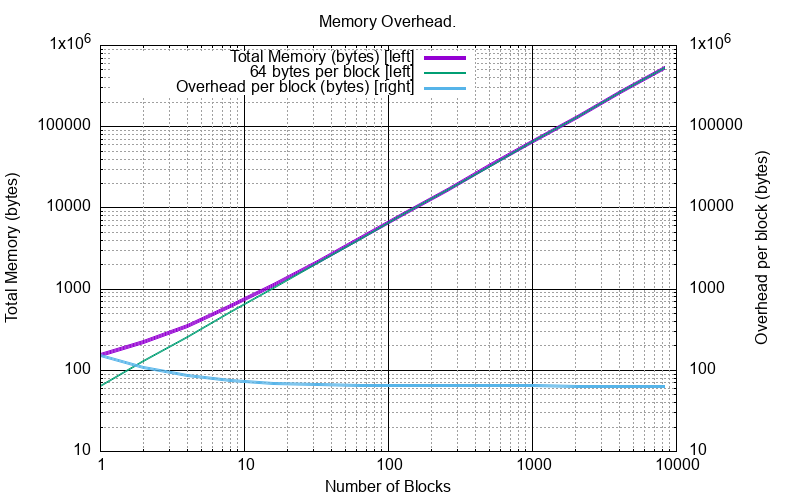
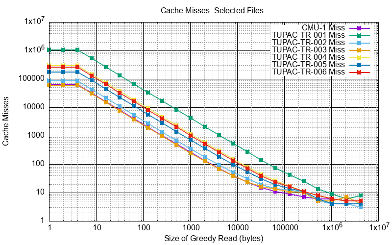
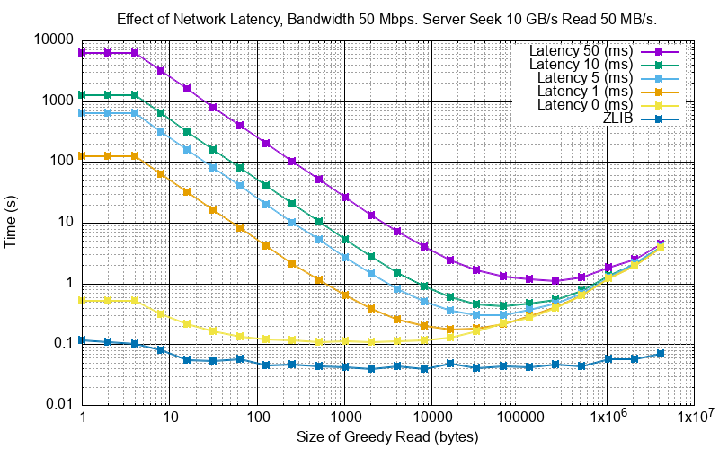
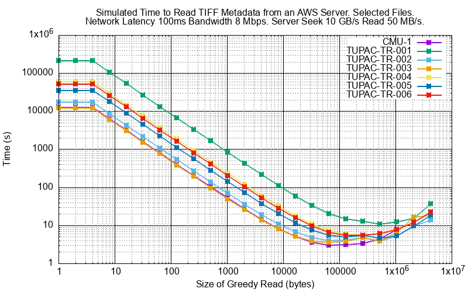

Technical Notes
################

Memory Overhead
===============

Inevitably there is an overhead to use an in-memory cache.
This is proportional to the number of blocks held, regardless of their individual size.

This works out at minimum of 154 bytes and asymptotically to 64 bytes a block.

Pickling
========

Pickling
--------

A Sparse Virtual File (``svfsc.cSVF``) can be pickled:

.. code-block:: python

    import pickle
    import svfsc

    svf = svfsc.cSVF('id')
    svf.write(21, b'ABCDEF')
    pickle_result = pickle.dumps(svf)
    # Save pickle_result somewhere

Un-Pickling
-----------

And to un-pickle:

.. code-block:: python

    import pickle
    import svfsc

    svf = svfsc.cSVF('id')
    svf.write(21, b'ABCDEF')
    pickle_result = pickle.dumps(s)
    new_svf = pickle.loads(pickle_result)
    assert id(new_svf) != id(svf)
    assert new_svf.id() == svf.id()
    assert new_svf.file_mod_date() == svf.file_mod_date()
    assert new_svf.blocks() == svf.blocks()

Pickling is versioned by an integer number.
As ``svfsc`` progresses this ensures that pickles from previous ``svfsc`` versions can be detected and either rejected or
read and modified, if possible.

Using ``pickletools``
---------------------

.. code-block:: python

    import pickle
    import pickletools
    import svfsc

    svf = svfsc.cSVF('id')
    svf.write(1, b' ')
    svf.write(12, b' ')
    pickle_result = pickle.dumps(s)
    pickletools.dis(pickle_result)

The result will be something like:

.. code-block:: text

        0: \x80 PROTO      4
        2: \x95 FRAME      106
       11: \x8c SHORT_BINUNICODE 'svfs'
       17: \x94 MEMOIZE    (as 0)
       18: \x8c SHORT_BINUNICODE 'cSVF'
       24: \x94 MEMOIZE    (as 1)
       25: \x93 STACK_GLOBAL
       26: \x94 MEMOIZE    (as 2)
       27: )    EMPTY_TUPLE
       28: \x81 NEWOBJ
       29: \x94 MEMOIZE    (as 3)
       30: }    EMPTY_DICT
       31: \x94 MEMOIZE    (as 4)
       32: (    MARK
       33: \x8c     SHORT_BINUNICODE 'id'
       37: \x94     MEMOIZE    (as 5)

       8<---- Snip --->8

       95: \x8c     SHORT_BINUNICODE 'pickle_version'
      111: \x94     MEMOIZE    (as 14)
      112: K        BININT1    1
      114: u        SETITEMS   (MARK at 32)
      115: b    BUILD
      116: .    STOP
    highest protocol among opcodes = 4

Pickling Overhead
-----------------

The following table shows the overhead, in bytes, when pickling.
The overhead is the length of the result of ``.dumps()`` minus the sum of the length of all blocks.
The table shows the overhead for different block counts and sizes.

.. list-table:: Pickling Overhead (bytes)
    :widths: 25 25 25 25
    :header-rows: 1
    :class: with-border

    * - Block Count
      - Block Size 1
      - Block Size 256
      - Block Size 4096
    * - 1
      - 109
      - 112
      - 112
    * - 16
      - 215
      - 278
      - 287
    * - 256
      - 2023
      - 2927
      - 3542
    * - 4096
      - 32743
      - 52982
      - 55622

Detecting File Changes
========================

This is tricky. If the remote file changes there is no real way that the ``SVF`` can know of this.
There are a couple of ways that the user of an ``SVF`` can detect this however.

File Modification Time
----------------------

On construction the ``SVF`` can take an optional file modification time as a float.
The user can query this with ``file_mod_time()`` and compare it with the latest file modification time and act
accordingly (like using ``.clear()`` and reload as necessary).

Cautious Overwrite
------------------

On construction the ``SVF`` can take an optional flag ``compare_for_diff``.
If True, then when making a ``write()`` if a data difference is detected on an overwrite an ``IOError`` will be raised.
This is a weak detection technique and adds about 25% to the cost of an overlapping write.

Greedy Gets
==================

With a high latency connection it will be expensive to make a lot of small requests so it makes sense to make a smaller
number of larger GETs, a form of *cache prefetching*.
This is done by passing a ``greedy_length`` value to ``need()`` and that will coalesce the result of ``need()`` where
possible.

For example an ``SVF`` with these ``need(file_position, length)`` blocks:

.. code-block:: text

    ((8,  4), (16, 4), (32, 4))

Requesting 40 bytes from file position 8 gives this minimal block set by ``need(8, 40)``:

.. code-block:: text

    ((12, 4), (20, 12), (36, 12),)

The same request with ``need(8, 40, greedy_length=64)`` gives this block set:

.. code-block:: text

    ((12, 64),)

The shorter request, but for more data may be cheaper. This can be explored with a simulator.

Network Simulator
=====================================

In ``cpy/simulator.py`` there is a simulator that can reproduce the effect of network latency, network bandwidth, server
seek/read times and writing data to a ``SVF``. The default configuration is:

- Network latency (each way): 10 milliseconds.
- Network bandwidth: 50 million bits per second.
- Server seek speed: 10 giga bytes per second.
- Server read speed: 50 million bytes per second.

The simulator can also take a ``greedy-length`` argument which allows you to tune your GET requests.

Some pre-built simulation requests are in ``cpy/sim_example.py``:

- A simple read of 32 bytes of data every 64 bytes up to a size of 20,480 bytes.
- Actual seek/read operations for reading TIFF metadata TIFF files up to around 2GB. This has a more detailed analysis of performance (below).

Synthetic File
-----------------

Here is the read time using different ``greedy_length`` values:

Reading TIFF Metadata
-------------------------

The second example is all the seek read operations to get all the TIFF metadata from selected TIFF files.
For each file the table gives:

- The file size in Mb
- The number of ``seek()/read()`` operations needed to read the TIFF metadata.
- The size of the TIFF metadata in bytes and as a proportion of the file size.

.. list-table:: Selected TIFF Files
    :align: center
    :widths: 40 25 40 40 30
    :header-rows: 1

    * - File
      - Size (MB)
      - ``seek()/read()`` ops
      - Metadata bytes
      - Metadata %
    * - CMU-1.tiff
      - 195
      - 62,615
      - 256,566
      - 0.126%
    * - TUPAC-TR-001.svs
      - 2,146
      - 1,051,242
      - 4,208,118
      - 0.187%
    * - TUPAC-TR-002.svs
      - 657
      - 84,845
      - 483,582
      - 0.070%
    * - TUPAC-TR-003.svs
      - 563
      - 59,936
      - 242,436
      - 0.041%
    * - TUPAC-TR-004.svs
      - 744
      - 291,302
      - 1,311,074
      - 0.168%
    * - TUPAC-TR-005.svs
      - 955
      - 176,754
      - 709,714
      - 0.071%
    * - TUPAC-TR-006.svs
      - 945
      - 254,948
      - 1,165,658
      - 0.118%

Given these sample files the time taken to read the TIFF metadata for various greed read lengths is:

The performance improvement is because ``SVF.has()`` is far more likely to succeed at larger ``greedy_length`` values.
Here are some file examples with the count of cache hits (``SVF.has()`` succeeds) and cache misses (``SVF.has()`` fails)
for different ``greedy_length`` values.

The minor drawback is that more bytes are read than strictly necessary.
For example with CMU-1.tiff and ``greedy_length=0`` the minimal byte set is
256,566 bytes total. With a ``greedy_length=131,072`` the total number of bytes read is 1,179,648.
This is about 4x the minimal read but still about 1/200 of the original file.

Here are examples off the total amount of data read for different ``greedy_length`` values:

.. note:: Linear scale

.. image:: ../../plots/images/py_sim_greedy_overhead.png

A Comparison Against a Local File Read
^^^^^^^^^^^^^^^^^^^^^^^^^^^^^^^^^^^^^^^^^

This is a comparison of the time it takes to read TIFF metadata when the file is on the local file system with
the simulator time for the same file, remotely with the network connection described above, using a greedy
length 64 KB.

.. list-table:: Selected TIFF Files
    :align: center
    :widths: 40 25 25 30 20
    :header-rows: 1

    * - File
      - Size (MB)
      - Local (s)
      - Remote (s)
      - Ratio
    * - CMU-1.tiff
      - 195
      - 0.139
      - 0.413
      - 3.0 x
    * - TUPAC-TR-001.svs
      - 2,146
      - 2.14
      - 3.22
      - 1.5 x
    * - TUPAC-TR-002.svs
      - 657
      - 0.183
      - 0.582
      - 3.2 x
    * - TUPAC-TR-003.svs
      - 563
      - 0.130
      - 0.512
      - 3.9 x
    * - TUPAC-TR-004.svs
      - 744
      - 0.597
      - 1.10
      - 1.8 x
    * - TUPAC-TR-005.svs
      - 955
      - 0.361
      - 0.815
      - 2.3 x
    * - TUPAC-TR-006.svs
      - 945
      - 0.521
      - 1.01
      - 1.9 x

So choosing a decent greedy length can get the remote performance within hailing distance of the local
file performance.

The Effect of Simulated Network Latency
^^^^^^^^^^^^^^^^^^^^^^^^^^^^^^^^^^^^^^^^^^

With the simulator we can experiment with various values of network latency (each way), bandwidth and greedy reads.
For example here is the result of reading TIFF metadata with different network latencies.

.. index::
    single: Zero Latency, Infinite Bandwidth

The ZLIB curve represents *Zero Latency, Infinite Bandwidth* and thus is the network performance floor and, as expected,
the greedy read length has little effect there as ``svfsc`` is an optimisation for *slow* networks:

As reading TIFF metadata is usually a large amount of scattered small reads then network latency has a dominant effect.
The poor performance of high latency networks can be improved greatly by using greedy reads.
High (64 KB) greedy reads can transform high latency (50 ms) networks to about 10x their ZLIB time.

The Effect of Simulated Network Bandwidth
^^^^^^^^^^^^^^^^^^^^^^^^^^^^^^^^^^^^^^^^^^

Here is the result of different bandwidths for a network latency (each way) of 10 ms.

With this level of network latency the bandwidth is almost irrelevant.
As usual high greedy lengths compensate and it is only when they are above 10,000 bytes or so does the bandwidth
become significant.
High (64 KB) greedy reads can transform low bandwidth (10 Mbps) networks to about 10x their ZLIB time.

Here is the result of different bandwidths for a network latency (each way) of 1 ms.

With this level of network latency the bandwidth becomes more significant.
Again, medium greedy reads (optimum around 8 to 32 KB) can transform low bandwidth (10 Mbps) networks to about 10x their ZLIB time.

.. raw:: latex

    \newpage

Amazon AWS Cloud Example
^^^^^^^^^^^^^^^^^^^^^^^^^^^^^^^^^^^^^^^^^^

Here is an example simulation where the TIFF files are on an AWS server with a typical connection latency (each way) of 100 ms and
a bandwidth of 1 MB/s (8Mb/s).

These values are very close to some measured data of TIFF files on AWS.

Running the Simulator
---------------------

Here is the help information for the simulator:

.. code-block:: console

    $ python src/cpy/simulator.py -h
    usage: src/cpy/simulator.py
           [-h] [-l LOG_LEVEL] [--latency LATENCY]
           [--bandwidth BANDWIDTH] [--seek-rate SEEK_RATE]
           [--read-rate READ_RATE] [--greedy-length GREEDY_LENGTH]
           [--realtime]

    Simulate reading into a SVF.

    options:
      -h, --help            show this help message and exit
      -l LOG_LEVEL, --log-level LOG_LEVEL
                            Log level.
      --latency LATENCY     Communications channel latency (NOTE: one way)
                            in ms. [default: 10]
      --bandwidth BANDWIDTH
                            Communications channel bandwidth in
                            million bits per second. Zero is infinite
                            bandwidth. [default: 50]
      --seek-rate SEEK_RATE
                            Server seek rate in million bytes per
                            second. [default: 10000]
      --read-rate READ_RATE
                            Server read rate in million bytes per
                            second. [default: 50]
      --greedy-length GREEDY_LENGTH
                            The greedy length to read fragments from
                            the server. Zero means read every
                            fragment. Default is to run through a
                            range of greedy lengths and report the
                            performance. [default: -1]
      --realtime            Run in realtime (may be slow).
                            [default: 0]

The simulator uses data in ``src/cpy/sim_examples.py``, in there are several examples of files.
These examples are just a tuple of ``(file_position, length)`` values, however they are Run Length
Encoded for compactness.

With no arguments the simulator runs through the pre-prepared set of values with a range of ``greedy-length`` values.
If ``greedy-length`` is give then the simulator just runs on that value.
For example, exploring the simulator with a ``greedy_length`` of 64 KB:

.. code-block:: console

    $ python src/cpy/simulator.py --greedy-length=65536
    Simulator setup:
    Network latency 10.000 (ms) bandwidth 50.000 (M bits/s)
    Server seek rate 10000.000 (M bytes/s) read rate 50.000 (M bytes/s)
    2023-05-09 13:00:46,285 - simulator.py#256  - INFO     - Running EXAMPLE_FILE_POSITIONS_LENGTHS_TIFF_CMU_1 with 62483 file actions and greedy_length 65536
    2023-05-09 13:00:46,724 - simulator.py#153  - INFO     - has(): hits: 62472 misses: 11
    2023-05-09 13:00:46,724 - simulator.py#154  - INFO     - Blocks: 8 bytes: 682936 sizeof: 683314 overhead: 378
    2023-05-09 13:00:46,724 - simulator.py#159  - INFO     - Comms time :    335.412 (ms) ( 81.7%) +++++++++++++++++++++++++++++++++++++++++
    2023-05-09 13:00:46,724 - simulator.py#164  - INFO     - Server time:     34.843 (ms) (  8.5%) ++++
    2023-05-09 13:00:46,724 - simulator.py#169  - INFO     - SVF time   :     40.268 (ms) (  9.8%) +++++
    2023-05-09 13:00:46,724 - simulator.py#179  - INFO     - Total      :    410.523 (ms) (100.0%)
    2023-05-09 13:00:46,724 - simulator.py#180  - INFO     - SVF contents: 682936 Execution time: 0.411 (s) 1.587 (Mb/s)
    2023-05-09 13:00:46,725 - simulator.py#256  - INFO     - Running EXAMPLE_FILE_POSITIONS_LENGTHS_TUPAC_TR_001_svs with 1051153 file actions and greedy_length 65536
    2023-05-09 13:00:52,913 - simulator.py#153  - INFO     - has(): hits: 1051080 misses: 73
    2023-05-09 13:00:52,913 - simulator.py#154  - INFO     - Blocks: 10 bytes: 4784128 sizeof: 4784570 overhead: 442
    2023-05-09 13:00:52,913 - simulator.py#159  - INFO     - Comms time :   2225.938 (ms) ( 69.6%) +++++++++++++++++++++++++++++++++++
    2023-05-09 13:00:52,913 - simulator.py#164  - INFO     - Server time:    320.664 (ms) ( 10.0%) +++++
    2023-05-09 13:00:52,913 - simulator.py#169  - INFO     - SVF time   :    649.409 (ms) ( 20.3%) ++++++++++
    2023-05-09 13:00:52,913 - simulator.py#179  - INFO     - Total      :   3196.010 (ms) (100.0%)
    2023-05-09 13:00:52,913 - simulator.py#180  - INFO     - SVF contents: 4784128 Execution time: 3.196 (s) 1.428 (Mb/s)
    EXAMPLE_FILE_POSITIONS_LENGTHS_TIFF_CMU_1:
     greedy_length   Time(ms)     Hits     Miss    Hits%   Min. Bytes   Act. Bytes  Act. / Min.     sizeof Overhead  sizeof / Act.
             65536      410.5    62472       11  99.982%       256566       682936     266.183%     683314     +378       100.055%
    EXAMPLE_FILE_POSITIONS_LENGTHS_TUPAC_TR_001_svs:
     greedy_length   Time(ms)     Hits     Miss    Hits%   Min. Bytes   Act. Bytes  Act. / Min.     sizeof Overhead  sizeof / Act.
             65536     3196.0  1051080       73  99.993%      4208118      4784128     113.688%    4784570     +442       100.009%
    Execution time:      6.636 (s)

Thread Safety
=============

If compiled with ``SVF_THREAD_SAFE`` and ``SVFS_THREAD_SAFE`` defined a C++ mutex is introduced to preserve thread safety.

The Python implementation does *not* set ``SVF_THREAD_SAFE`` and ``SVFS_THREAD_SAFE``, instead it uses Python mutexes
using the technique `described here <https://pythonextensionpatterns.readthedocs.io/en/latest/thread_safety.html>`_.

.. warning:: Thread safety is strictly limited to make each API call atomic to that thread.

    There is no contention resolution among API calls.
    For example thread A could call ``need()`` on a SVF and then thread B calls, for example,
    ``write()``, ``erase()`` or ``clear()`` which might or would invalidate the ``need()`` information held by thread A.

.. _cache_punting:

Cache Punting
=============

The current design has the following characteristics:

- The is no punting, the cache always expands.
- Blocks are coalesced where possible. This is enforced by integrity checks that do not allow adjacent blocks.
- The SVF is not a read-through cache, it is only advisory to the caller.

Problems With Punting
---------------------

The basic use case is that the caller checks the SVF by calling ``SparseVirtualFile::has()`` and there will be one of
two outcomes:

All the Data is in the Cache
^^^^^^^^^^^^^^^^^^^^^^^^^^^^^^^^^^^^

Then the caller is free to call ``SparseVirtualFile::read()`` which is (must be) guaranteed to succeed.
If this call is immediate (or at least before any other call that might trigger punting) then this does not present a
challenge, merely the block with the data is marked with a fresh access time/integer.
There is no punting required.

If the call between ``SparseVirtualFile::has()`` and ``SparseVirtualFile::read()`` is interleaved with a call that
triggers a punt then the ``SparseVirtualFile::read()`` is not necessarily guaranteed to succeed.
This presents a problem for the caller.

Some of the Data is not in the Cache
^^^^^^^^^^^^^^^^^^^^^^^^^^^^^^^^^^^^

If ``SparseVirtualFile::has()`` returns ``false`` then the canonical behaviour of the caller is then to:

- Call ``SparseVirtualFile::need()``
- Go and get the data somehow.
- Call ``SparseVirtualFile::write()``
- Call ``SparseVirtualFile::read()`` which gives the caller a copy of the data.

This sequence is expected to always succeed.
However we must consider that other sequences of events might exist, for example the caller decides not to write or
even read.
Alternatively a caller might go part way through that sequence but then call ``SparseVirtualFile::read()`` of another,
or smaller, part of the file.
This call might touch blocks previously touched by the original ``SparseVirtualFile::need()`` call.

One approach is that any punting must happen at the end of a ``SparseVirtualFile::read()`` once the copy has been made.
This would mean that the memory used might exceed the cache limit in the intervening ``SparseVirtualFile::write()``.

Another approach would be to mark the blocks somehow when ``SparseVirtualFile::need()`` is called and then unmark them
when ``SparseVirtualFile::read()`` is called affecting those blocks.
Meanwhile any punting during a ``SparseVirtualFile::write()`` has to ignore marked blocks.

Both mean that a second ``SparseVirtualFile::read()`` to the same place is *not* guaranteed to succeed.

Multi-threading Guarantees
^^^^^^^^^^^^^^^^^^^^^^^^^^

This problems are especially acute in a multi-threaded environment.

Compromise Design
-----------------

The compromise is to provide APIs that can assist the caller who has full knowledge the callers state is and all of its
threads.
The caller is responsible for deciding when and how much to punt.

The SVF marks each block with and integer that represents the age of last use (the so-called 'touch' integer).
This integer starts at 0 and monotonically increases with each read/write so older blocks have lower values.
When blocks are coalesced the resulting block is marked as being newest regardless of the touch values of the previous
blocks.

The API is ``lru_punt()`` for both C++ and Python.
This takes a single argument as an integer upperbound of the bytes held by the cache.
This prunes older blocks which have low touch values until the cache is the required size but always one block will
remain.
It returns the number of bytes removed from the cache.
